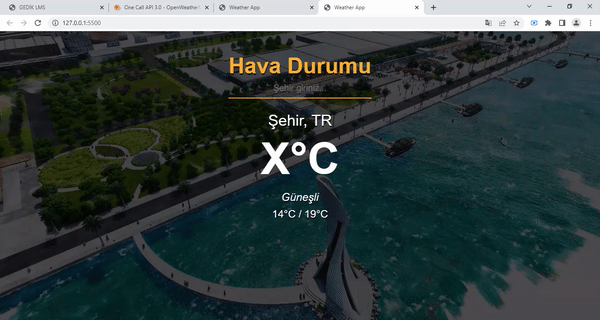

<h1>Weather App
    Güncel Hava Durumu</h1>

<h3>Kullanılan Teknolojiler</h3>
<h3>JavaScript HTML5 CSS3 VsCode</h3>

<h4>Sorgulanan şehirlerin güncel hava durum bilgilerini js teknolojisi kullanılarak web ekranına yazdırma</h4>

